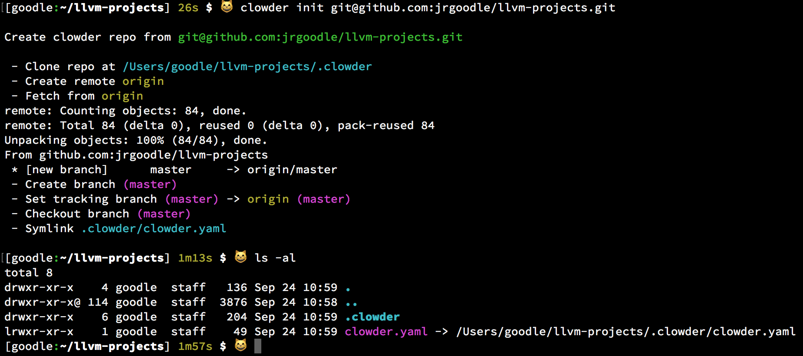
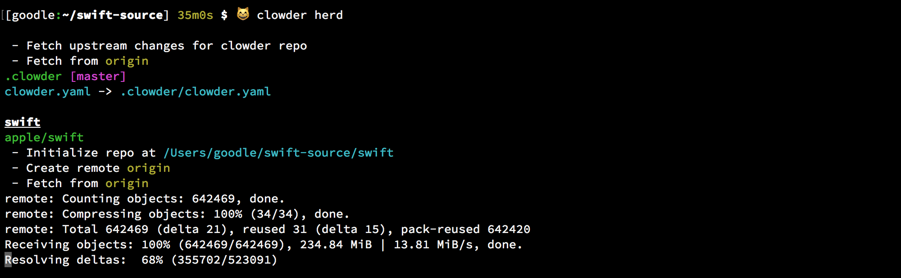
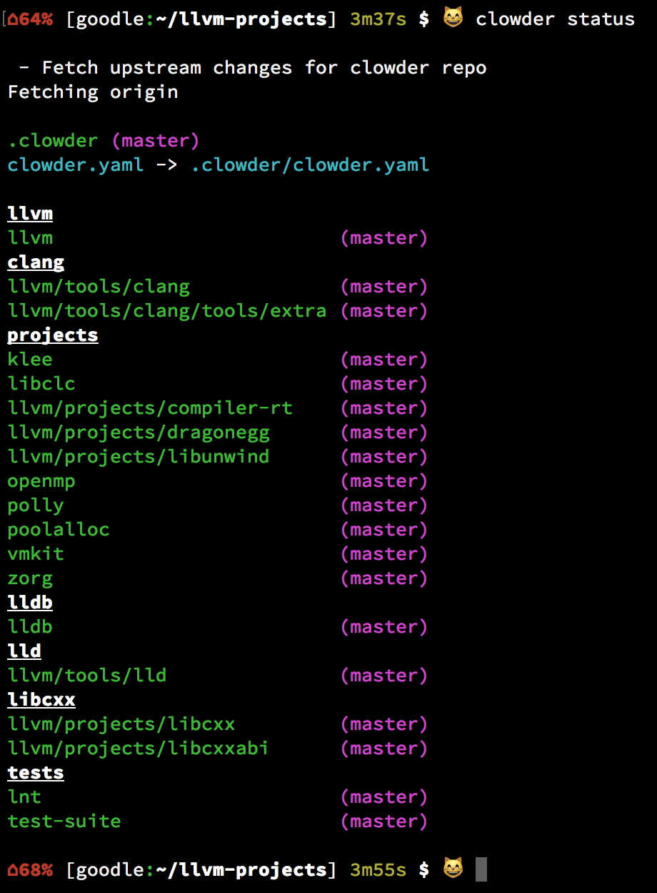

# `clowder` [](https://travis-ci.org/JrGoodle/clowder)

> **clowder** - A group of cats

> **herding cats** - An idiom that refers to a frustrating attempt to control or organize a class of entities which are uncontrollable or chaotic

Managing multiple repositories can be pretty frustrating. There are a number of existing options:

- [git submodules](https://git-scm.com/book/en/v2/Git-Tools-Submodules)
- [subtree merging](https://git-scm.com/book/en/v1/Git-Tools-Subtree-Merging)
- [Google's repo tool](https://code.google.com/p/git-repo/)
- [braid](https://github.com/cristibalan/braid)
- [gr](https://github.com/mixu/gr)
- [git-subrepo](https://github.com/ingydotnet/git-subrepo)

All of these have their own approach, but many are based on submodules or subtrees. Submodules and subtrees create a tight coupling between repositories because of the way dependencies are stored. Much has been written about their drawbacks elsewhere. Google's `repo` tool takes a different approach, but is closely tied to Google's development workflow

`clowder` uses a similar approach as `repo`, but using yaml instead of xml for the configuration file. URL information and relative project locations on disk are specified in a `clowder.yaml` file. This file is checked into its own repository. The use of a separate file to track projects allows for detailed information about the dependencies between them to be stored, but each repository is still essentially independent. Projects can track branches, or be tied to specific tags or commits

The primary purpose of `clowder` is synchronization of multiple repositories, so normal development still takes place in individual repositories with the usual `git` commands

# Getting Started

## Requirements

- [git](https://git-scm.com)
- [Python 3](https://www.python.org/downloads/)

### macOS

macOS comes with `git` preinstalled. To install Python 3 with [Homebrew](https://brew.sh)

```bash
$ brew install python3
```

### Ubuntu 16.04

```bash
$ sudo apt install git
$ sudo apt install python3-pip
```

### Windows

Currently `clowder` has only been tested on Windows with [Cygwin](https://cygwin.com/install.html). The following dependencies should be installed

- git
- python3-pip
- python3

## Installation

To install `clowder` from PyPI

```bash
$ sudo pip3 install clowder-repo
```

To upgrade to the latest version

```bash
$ sudo pip3 install clowder-repo --upgrade
```

For terminal autocompletion add the following line to your bash profile

```bash
command -v clowder >/dev/null 2>&1 && eval "$(register-python-argcomplete clowder)"
```

# Usage

This example is based on the [Swift projects](https://github.com/apple/swift) (see the full [Swift projects clowder.yaml](https://github.com/JrGoodle/swift-clowder/blob/master/clowder.yaml))

First reate a directory to contain all the Swift projects

```bash
$ mkdir swift-source
$ cd swift-source
```

## `clowder init`

```bash
$ clowder init git@github.com:jrgoodle/swift-clowder
```



The `clowder init` command does the following
- Clones the [Swift clowder repo](https://github.com/JrGoodle/swift-clowder) in the `swift-source/.clowder` directory
- Creates a symlink pointing to the primary `clowder.yaml` file in the repository

## `clowder herd`

```bash
$ clowder herd
```



`clowder herd` updates the state of the projects. When the command is run, the following happens
- If any projects don't have a clean git status then `clowder` exits
- Projects are cloned if they don't currently exist
- Each project fetches the latest changes
- If the current git ref checked out doesn't match the `clowder.yaml` configuration, the correct ref will be checked out
- The latest changes are pulled for branches. For commits and tags, the commits are checked out into a detached `HEAD` state

## `clowder status`

```bash
$ clowder status
```



# Further Information

## More commands

```bash
$ clowder branch # Print all local branches
$ clowder clean # Discard any changes in projects
$ clowder diff # Print git diff for all projects
$ clowder forall -c 'git status' # Run command in all project directories
$ clowder herd -b my_branch # Herd a specified branch if it exists, otherwise use default ref
$ clowder link -v 0.1 # Set clowder.yaml symlink to a previously saved version
$ clowder repo run 'git status' # Run command in .clowder directory
$ clowder save 0.1 # Save a version of clowder.yaml with current commit sha's
$ clowder start my_feature # Create new branch 'my_feature' for all projects
$ clowder stash # Stash changes in all projects
$ clowder prune stale_branch # Prune branch 'stale_branch' for all projects
```

See the [clowder commands doc](https://github.com/JrGoodle/clowder/blob/master/docs/commands.md)
for documentation of all command options

For example output from [individual commands](https://github.com/JrGoodle/clowder/tree/master/docs#commands)

## The `clowder.yaml` file

See the [clowder.yaml doc](https://github.com/JrGoodle/clowder/blob/master/docs/clowder-yaml.md)
for an explanation of the `clowder.yaml` configuration file

## The clowder repo

See the [clowder repo doc](https://github.com/JrGoodle/clowder/blob/master/docs/clowder-repo.md)
for a description of the structure of the clowder repo cloned in the `.clowder` directory

## Development

See the [development doc](https://github.com/JrGoodle/clowder/blob/master/docs/development.md) for information on setting up your environment for development
