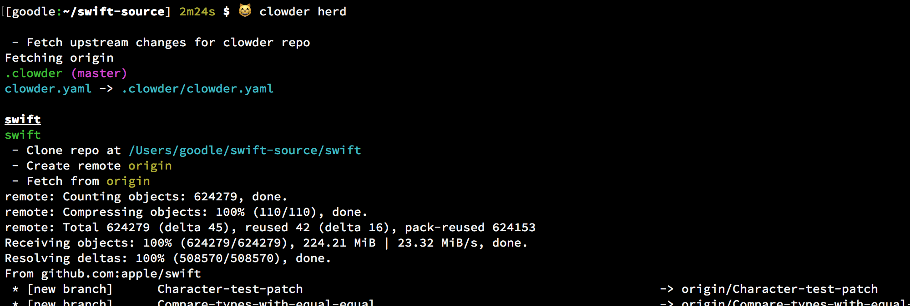
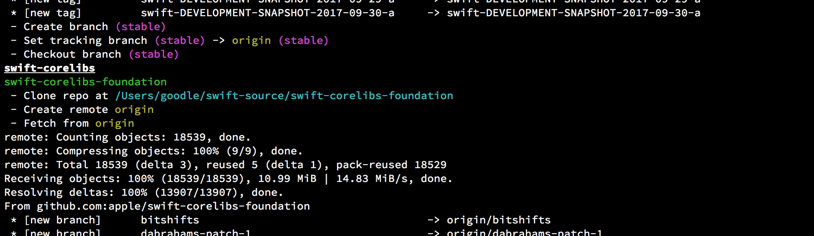
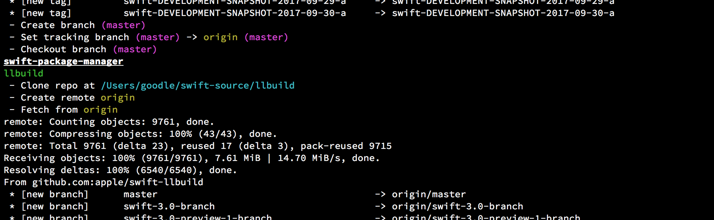

# `clowder herd`

Subset of the output from an initial invocation of `clowder herd` for the [Swift clowder repo](https://github.com/JrGoodle/swift-clowder) after running `clowder init`

...

...

...

...

...

